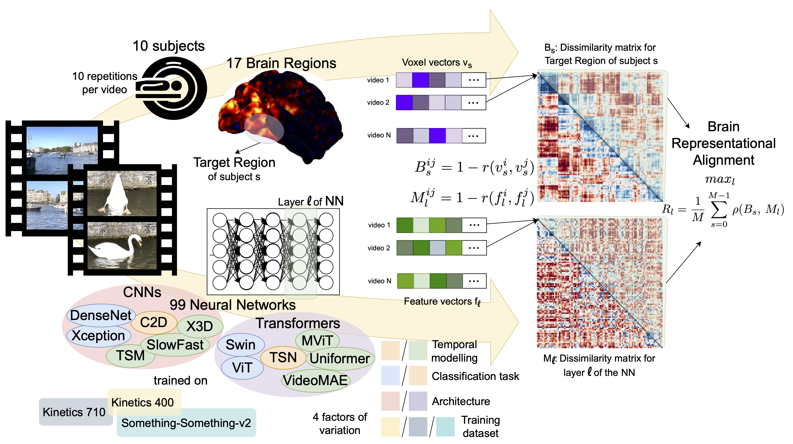

What can we learn from comparing video models to human brains, arguably the
most efficient and effective video processing systems in existence?

We take a step towards answering this question by performing the **first large-scale
benchmarking of deep video models on representational alignment to the human
brain**, using publicly available models and a recently released video brain imaging
(fMRI) dataset.



## 👉 We disentangle 4 factors of variation:

# 1. Temporal modeling − 2. Classification task


Temporal modeling found important for alignment to early brain regions, while action recognition classification task to late regions

# 3. Architecture


CNNs and Transformers are mostly equivalent in maximum score, but display interesting layer-wise differences

# 4. Training dataset


There is a distinct effect of training biases on alignment to functionally selective regions

# 👉 We rank the models in terms of brain alignment:


# 👉 And we relate their brain alignment to their computational complexity:


# BibTeX
```
@inproceedings{
  sartzetaki2025one,
  title={One Hundred Neural Networks and Brains Watching Videos: Lessons from Alignment},
  author={Christina Sartzetaki and Gemma Roig and Cees G. M. Snoek and Iris Groen},
  booktitle={The Thirteenth International Conference on Learning Representations},
  year={2025},
  url={https://openreview.net/forum?id=LM4PYXBId5}
}
```
